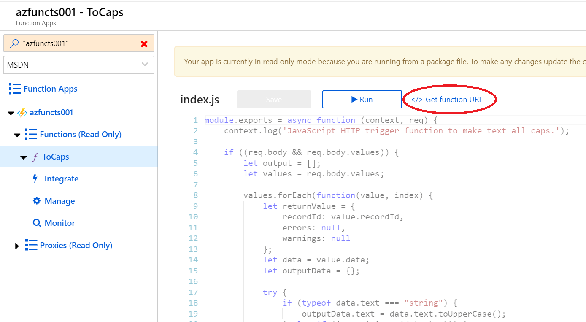

# Summary

This repository provides an example of Azure Search, utilizing the [cognitive search](https://docs.microsoft.com/en-us/azure/search/cognitive-search-concept-intro) to index data from documents and images.

The example provides the necessary [REST APIs](https://docs.microsoft.com/en-us/rest/api/searchservice/) to create an index, skillset, and indexer to read files from a Storage Account. Also, the example provides an example of using [Custom Web API Skillset](https://docs.microsoft.com/en-us/azure/search/cognitive-search-custom-skill-web-api) using [Azure Functions](https://docs.microsoft.com/en-us/azure/azure-functions/functions-overview)

Currently, the example does not cover details on the following:
- Creation of necessary resources (Azure Search, Function, Storage Account, Cognitive Services)
- Deployment of Function from VSCode
- Detailed use of Postman

Last Updated 2019/10/25

---

# Prerequisites

- Azure subscription
- Postman
- Visual Studio Code

---

# Setup Instructions

## Import the json files into Postman

| Filename | Description |
| -------- | ----------- |
| SearchAPI.postman_environment.json | List of Environment variables used in the API definition. Import as a Postman Environment and update values to match you env (details [below](#variables)). | 
| SearchAPIs.postman_collection.json | Includes API definitions to Setup Azure Search and test Azure Function |

### Postman APIs

| API Name | Description |
| -------- | ----------- |
| CreateIndex | Creates Index |
| DeleteIndex | Deletes Index |
| CreateIndexer | Creates Indexer |
| DeleteIndexer | Deletes Indexer |
| CreateDatasource | Creates Data Source |
| CreateSkillset | Creates Skillset |
| DeleteSkillset | Delete Skillset |
| CustomSkill-Fuctions | Test the Function API |

### Postman Variables

| Variable name | Description |
| ------------- | ----------- |
| api-version | 2019-05-06 |
| api-key | Use API Key to access Azure Search |
| data-store-connection-string | Get the connection string for the Storage Account to upload documents and images you want to analyze with Azure Search |
| cognitive-service-key | Add the API Key for Azure Cognitive Service to use for Azure Cognitive Search |
| search-name | Name of the Azure Search service you created |
| index-name | Name of the index you want to create |
| datasource-name | Name of the Data source in your Azure Search |
| skillset-name | Name of the Skillset in your Azure Search |
| indexer-name | Name of the Indexer to create in your Azure Search |
| webapi-function-url | The Function URL for your Custom Web API. You can use it for your local environment too. |

## Deploying the Azure resources

The following resources are necessary for this example. Noted are particular values/keys you need to retrieve from each service.

- Azure Search
  - API Key
- Function (Linux based, consumption model)
  - Function URL (will be created after [deploying the function](#deploying_the_function_for_custom_web_api))
- Storage Account
  - Connection String
- Cognitive Services
  - API Key

## Deploying the Function for Custom Web API

The code for the function is provided in the /functions directory. Using the VSCode Functions Extension, deploy this to a Linux based Function.

Once it is deployed, navigate to your Function and note the Function URL.

## Setting up Azure Search

The necessary APIs should be set up in Postman. When experimenting with new indices, there will be a lot of experimentation. You will repeatedly delete and create the index until you achieve the result you want.

The Postman example has both create and delete for the necessary features, index, skillset and indexer.
When creating the index, you will want to Execute the APIs in the following order.

1. CreateIndex
2. CreateSkillset
3. CreateIndexer

Once you execute all the API requests, navigate to the Azure Search resource. Check under **Overview > Indexer** and see that the indexer you created show **Status: Success**

Now, check the index with **Search explorer**. Make sure you see the documents indexes with items in the **keyPhrases** field in all UpperCase.

---

# Details

## Architecture

Flow diagram of the skillset in this repository. 

## Resources

- [Create a basic index in Azure Search](https://docs.microsoft.com/en-us/azure/search/search-what-is-an-index)
- [Indexers in Azure Search](https://docs.microsoft.com/en-us/azure/search/search-indexer-overview)
- [Attach a Cognitive Services resource with a skillset in Azure Search](https://docs.microsoft.com/en-us/azure/search/cognitive-search-attach-cognitive-services)
